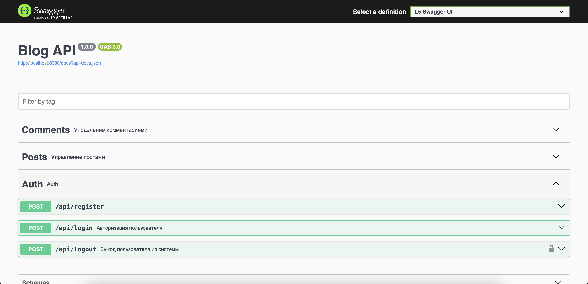
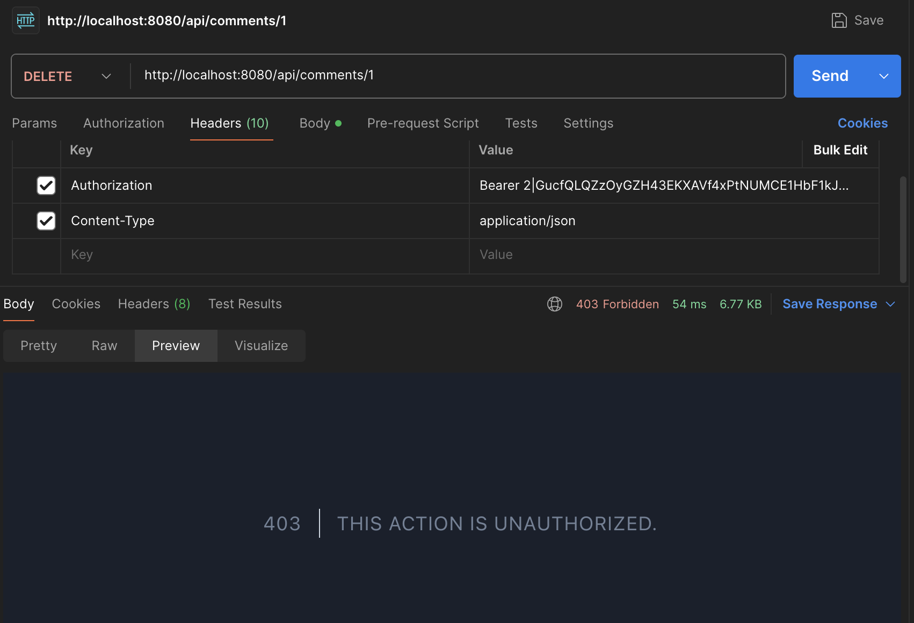
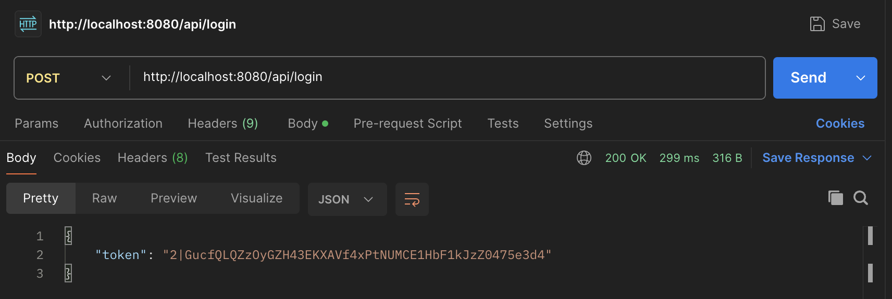
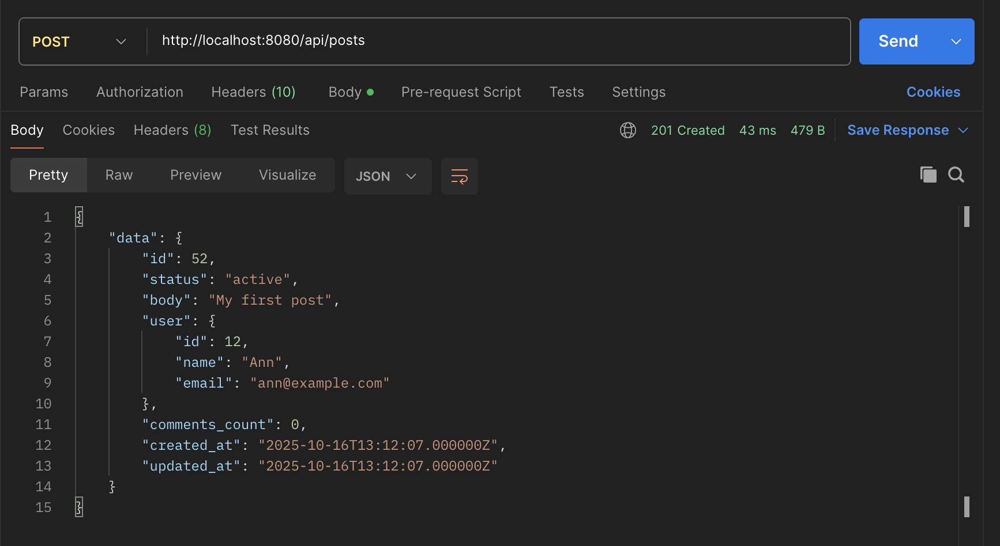
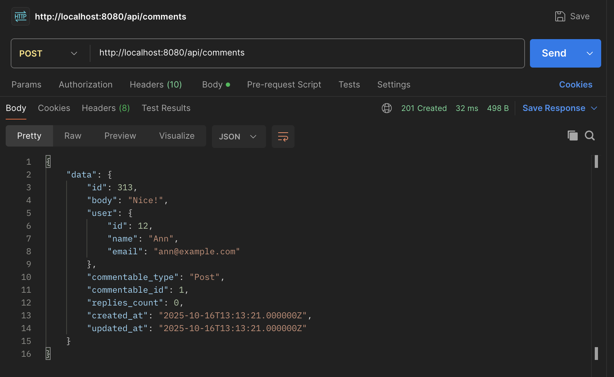
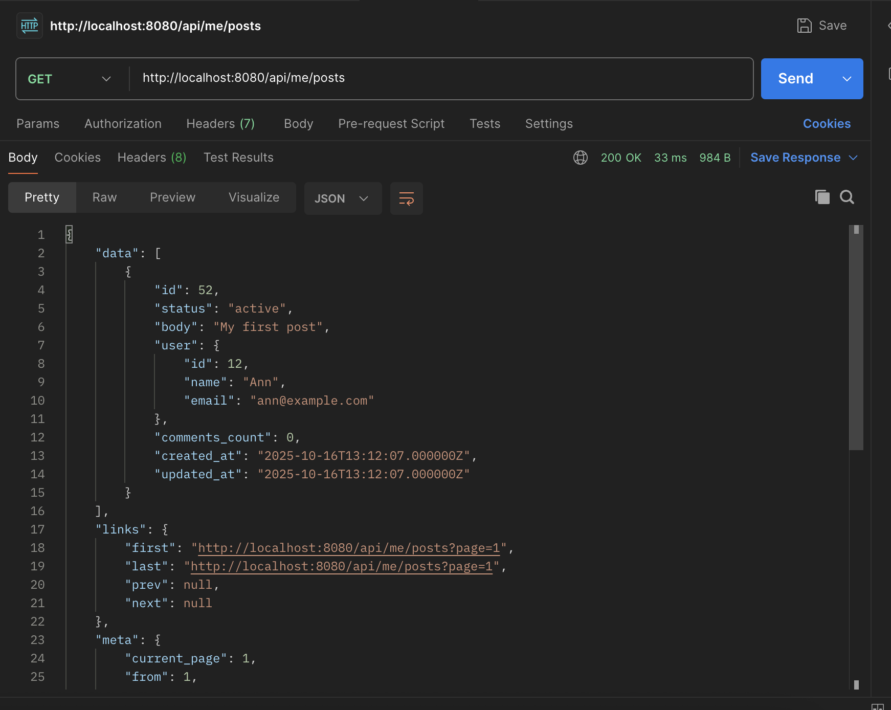

# Blog API

RESTful API для управления пользователями, постами и комментариями.  

---

## Запуск проекта

### 1. Клонирование репозитория
```bash
git clone https://github.com/AngelinaDementeva/blog-api.git
cd blog-api
```

### 2. Запуск Docker-контейнеров
```
docker compose up -d
```

### 3. Установка зависимостей
```
docker exec -it blog-api-app-1 composer install
```

### 4. Настройка окружения

Создай .env, если его нет:
```
cp .env.example .env
```

Настройки БД должны совпадать с docker-compose.yml:
```
DB_CONNECTION=mysql
DB_HOST=db
DB_PORT=3306
DB_DATABASE=blog
DB_USERNAME=blog
DB_PASSWORD=blog
```
### 5. Миграции и сиды
```
docker exec -it blog-api-app-1 php artisan migrate --seed
```

### 6. Генерация ключа приложения
```
docker exec -it blog-api-app-1 php artisan key:generate
```

### 7. Генерация документации Swagger
```
docker exec -it blog-api-app-1 php artisan l5-swagger:generate
```

### После этого Swagger будет доступен по адресу:
```
http://localhost:8080/api/documentation
```

---

## Аутентификация

Используется Laravel Sanctum.

## Регистрация

```POST /api/register```

```
{
  "name": "Angelina",
  "email": "angelina@example.com",
  "password": "12345678",
  "password_confirmation": "12345678"
}
```

## Логин

```POST /api/login```

```
{
  "email": "angelina@example.com",
  "password": "12345678"
}
```

Ответ:

```
{
  "token": "2|ZxjFiGxF..."
}
```

Используй токен в заголовке:
Authorization: Bearer <token>

### Запуск всех тестов:

``` 
docker exec -it blog-api-app-1 php artisan test`
``` 

---
### Примеры работы
  
  
 
 
 
